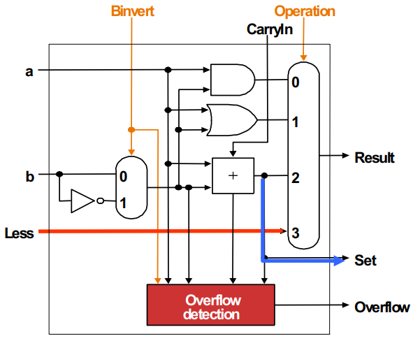
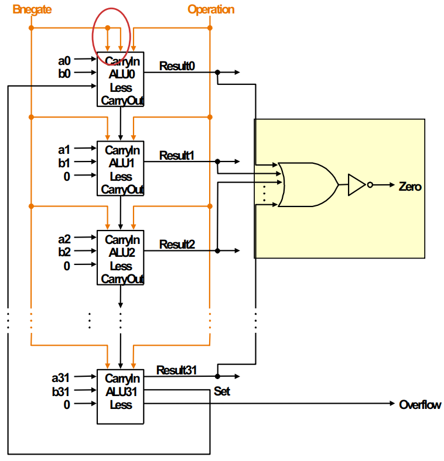
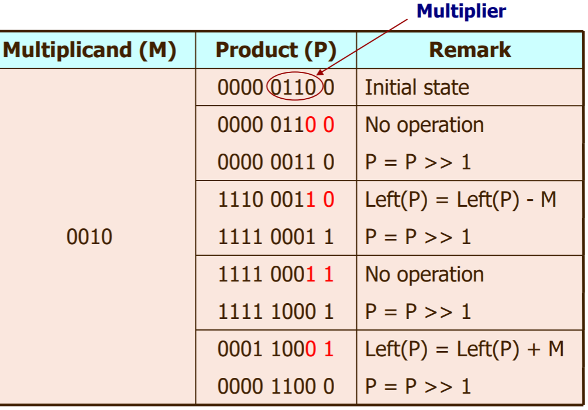
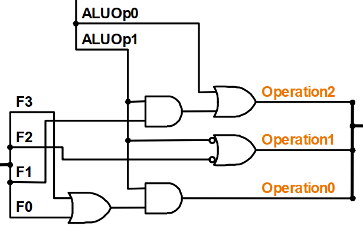
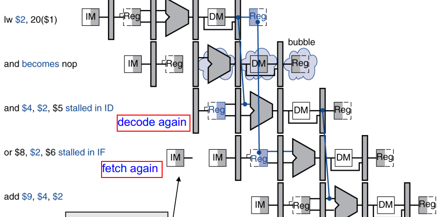
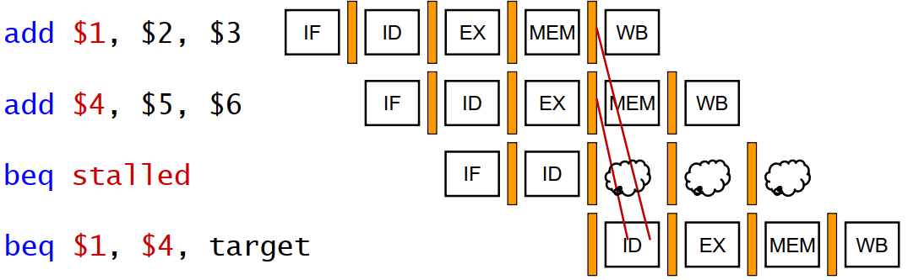
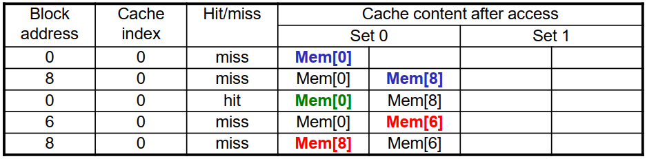

# COMP2611

COMP2611	Computer Organization  
Spring 2018, HKUST  
Notes by **Gerald Liu**  
[wliuax@connect.ust.hk](mailto:wliuax@connect.ust.hk)

[TOC]

## Digital Logic

Gates: AND, OR, NOT, NAND, NOR, XOR

1-bit half adder: S = A &oplus; B, C = A &sdot; B

### Combinational Logic

Multiplexor (Selector): 2^n^ data inputs, n selection inputs (1-bit), 1 output

Decoder: 1 n-bit input, 2^n^ 1-bit outputs

Canonical forms: D = &sum; m~i~ = &prod; M~i~ &rarr; simplify with Boolean Algebra or K-map (cells following Grey code)

### Sequential Logic

S-R latch (R,S): latch (0,0) / reset to 0 (1,0) / set to 1 (0,1) / invalid (1,1)

D latch (D, WE): latch (WE = 0) / set to D (WE = 1)

Register: a collection of D latches controlled by a common WE

D Flip-flop: output updates on clock edges (falling / rising)

## Data Representation

### Integer

Unsigned integer: [000...00~2~, 111...11~2~] = [0, 2^k^-1]

Signed integer: [100...00~2~, 011...11~2~] = [-2^k-1^, 2^k-1^-1]  
Positive to negative (in 2's complement):
- e.g. +6 = 0110~2~
- Invert bits: -7 = 1001~2~
- Add 1: -6 = 1010~2~

Zero extension: bitwise logical operations, unsigned int  
Signed extension: signed int

### Floating Point

| S    | Exponent (biased)                     | Significand                      |
| ---- | ------------------------------------- | -------------------------------- |
| 1    | 8 (single) / 11 (double)              | 23 (single) / 52 (double)        |
| 0/1  | Exponent + Bias = Exponent + 2^k-1^-1 | after an implicit 1 (hidden bit) |

| &nbsp;&nbsp;&nbsp;&nbsp;&nbsp;&nbsp;&nbsp;&nbsp;&nbsp;&nbsp;&nbsp;&nbsp;&nbsp;&nbsp;&nbsp;&nbsp;&nbsp;&nbsp;&nbsp;&nbsp;&nbsp;Exponent <br/>Significand | 0<br/>(denormalized) | [1, 2^k^-2]<br/>(normalized) | 2^k^-1<br/>(special cases) |
| :----------------------------------------------------------- | :------------: | :-----------: | :-----------: |
| **0**                                                       |       0        |       (-1)^S^ &times; 1.F &times; 2^E-Bias^       |       (-1)^S^ &times; &infin;       |
| $\neq$ **0**                                             |    (-1)^S^ &times; 0.F &times; 2^-126^    |       (-1)^S^ &times; 1.F &times; 2^E-Bias^       |       NaN       |

### Character

unsigned byte (8 bits) following the ASCII standard.

## ISA
### Syntax

```
# Data segment
.data
h: .word 1 2 3 4	# h is an array of size 4, each element is a word (32 bit)
s: .word 5

# Program begins
.text
.globl __start
__start:

add		$rd, $rs, $rt	# $rd = $rs + $rt
sub		$rd, $rs, $rt	# $rd = $rs - $rt
addi	$rt, $rs, imm	# $rt = $rs + imm
addu	$rd, $rs, $rt	# $rd = $rs + $rt, ignoring overflow
subu	$rd, $rs, $rt	# $rd = $rs - $rt, ignoring overflow
addiu	$rt, $rs, imm	# $rt = $rs + imm(sign-extended), ignoring overflow

mult	$rs, $rt		# Hi, Lo = $rs * $rt
multu	$rs, $rt
# overflow ignored, no overflow if Hi is 0 for multu or the replicated sign of Lo for mult

div		$rs, $rt		# Lo = $rs / $rt; Hi = $rs % $rt
divu	$rs, $rt

mflo	$rd				# $rd = Lo
mfhi	$rd 			# $rd = Hi

li		$rd, 100		# $rd = 100
move	$rd, $rs		# $rd = $rs
la		$rd, label		# $rd = addr(label)

and		$rd, $rs, $rt	# $rd = $rs & $rt; AND
or		$rd, $rs, $rt	# $rd = $rs | $rt; OR
nor		$rd, $rs, $rt	# $rd = ~($rs | $rt); NOR
nor		$rd, $rs, $0	# $rd = ~$rs; NOT
xor		$rd, $rs, $rt	# $rd = $rs ^ $rt; XOR
andi	$rt, $rs, 100	# $rt = $rs & 100
ori		$rt, $rs, 100	# $rt = $rs | 100

sll		$rd, $rt, 3		# $s1 = $s2 << 2 = $s2 * 2^2; Shift left by constant
srl		$rd, $rt, 3		# $s1 = $s2 >> 2 = $s2 / 2^3; Shift right by constant
sllv	$rd, $rt, $rs	# $rd = $rt << $rs
srlv	$rd, $rt, $rs	# $rd = $rt >> $rs

# Data transfer
# Big-endian: the end of a word matches a bigger address
lw		$rt, 100($rs)	# $rt = mem[$rs+100]; load word to reg from mem
sw		$rt, 100($rs)	# Memory[$rs+100] = $rt; store word from reg to mem

lb		$rt, 100($rs)	# load byte, sign extended to 32 bits in $rt
lbu		$rt, 100($rs)	# load byte unsigned, zero extended to 32 bits in $rt
sb		$rt, 100($rs)	# store rightmost byte in $rt


# if-else statement
	beq $s3, $s4, If
	beq $s3, $s1, ElseIf
	j Else
If: add $s0, $s1, $s2
	j exit
ElseIf: sub $s0, $s1, $s2
	j exit
Else: add $s0, $s1, $s4
	exit:

# while loop
Loop: bne $t0, $s2, Exit	 # go to Exit if $t0 != $s2
	# ...
	addi $s1, $s1, 1		# $s1 = $s1 + 1
	j Loop
Exit:

# Branch comparison
slt		$rd, $rs, $rt	# $rd gets 1 if $rs < $rt
bne		$rs, $0, Label	# go to L if $rs != 0
# slti $rt, $rs, 10

# unsigned comparison
sltu	$rd, $rs, $rt
sltiu	$rt, $rs, imm	# imm is sign-extended

# blt (‘branch on less than’)
# ble (‘branch on less than or equal’)
# bgt (‘branch on greater than’)
# bge (‘branch on greater than or equal’)
# Branch comparison with zero
bgez $s, label	# if ($s >= 0)
bgtz $s, label	# if ($s > 0)
blez $s, label	# if ($s <= 0)
bltz $s, label	# if ($s < 0)

# Nested procedures
	jal proc1	#20 # [jump] $ra = PC + 4 = 24; [and link] PC = addr(proc1) = 60
	...	        #24
proc1: push		#60 # addi $sp, $sp, -4; sw $ra, 0($sp)
	...         #64
	jal proc2   #68 # [jump] $ra = PC + 4 = 72; [and link] PC = addr(proc2) = 80
	pop         #72 # lw $ra, 0($sp); addi $sp, $sp, 4;
	jr $ra      #76 # return to #24
	...
proc2: push		#80 # addi $sp, $sp, -4; sw $ra, 0($sp)
	...       	#84
	pop         #88 # lw $ra, 0($sp); addi $sp, $sp, 4;
	jr $ra      #76 # return to #72

# load a 32-bit constant 0x003D0900
lui $s0, 61		    # load upper immediate as 61 = 0x003D
# $s0 = 0000 0000 0011 1101 0000 0000 0000 0000
ori $s0, $s0, 2304	# set the lower 16 bits from 0s to 2304 = 0000 1001 0000 0000
```
### Registers

| Name      | Number  | Use                                                          | Preserved on Call? |
| --------- | ------- | ------------------------------------------------------------ | --------------------- |
| \$zero    | \$0      | constant 0                                                   | N/A                   |
| \$at      | \$1      | assembler temporary                                          | N/A                 |
| \$v0–\$v1 | \$2–\$3   | function returns and expression evaluation        | No                    |
| \$a0–\$a3   | \$4–\$7   | function arguments                                           | No                    |
| \$t0–\$t7   | \$8–\$15  | temporaries                                                  | No                    |
| \$s0–\$s7   | \$16–\$23 | saved temporaries                                            | Yes                   |
| \$t8–\$t9   | \$24–\$25 | temporaries                                                  | No                    |
| \$k0–\$k1   | \$26–\$27 | reserved for OS kernel                                       | N/A                   |
| \$gp     | \$28     | global pointer                                        | Yes |
| \$sp       | \$29     | stack pointer | Yes                   |
| \$fp       | \$30     | frame pointer | Yes                   |
| \$ra       | \$31     | return address | Yes                   |

Program counter (PC) : holds the address of current instruction  
updated after executing: PC = PC + 4 or PC = branch target address

### Instruction Encoding

#### R-format

| op     | rs                    | rt                    | rd                   | shamt        | funct         |
| ------ | --------------------- | --------------------- | -------------------- | ------------ | ------------- |
| 6 bits | 5 bits                | 5 bits                | 5 bits               | 5 bits       | 6 bits        |
| opcode | 1^st^ register source | 2^nd^ register source | register destination | shift amount | function code |

usage: `add, sub, and, or, sll, srl`

#### I-format

| op     | rs            | rt                            | const / address                                              |
| ------ | ------------- | ----------------------------- | ------------------------------------------------------------ |
| 6 bits | 5 bits        | 5 bits                        | 16 bits                                                      |
| opcode | base register | register source / destination | const: [-2^15^, 2^15^-1]<br/>address: offset on base address |

usage: `andi, ... , lw, sw`

Conditional branches: PC-relative addressing

- Branch Address = PC + 4 + Branch Offset &times; 4 (Branch Offset is described in number of **words**)
- Branching range: [-128KB, 128KB-1] = 2^16^B

#### J-format

| op     | const   |
| ------ | ------- |
| 6 bits | 26 bits |

Pseudo-direct Addressing:

- Jump Address = const concatenated with the upper 4 bits of PC
- Jump Range: 256MB = 2^26^B

## Computer Arithmetic

### 2's Complement Arithmetic

Overflow condition:

| Operation | Sign of X | Sign of Y | Sign of Result |
| :-------: | :-------: | :-------: | :-------: |
| X + Y     | 0         | 0         | 1              |
| X + Y     | 1         | 1         | 0              |
| X - Y     | 0         | 1         | 1              |
| X - Y     | 1         | 0         | 0              |

Control jumps to a predefined address (code) to handle the exception.  
The interrupted address is saved to EPC (Exception Program Counter) &ndash; return to it via `jr`

### Arithmetic Logic Unit

Processor = Control Unit + ALU (arithmetic and logical operations) + Registers & Cache

Adder:

- 1-bit half adder: $C = ab$, $S = a \oplus b$

- 1-bit full adder: $C_{out}=(a+b)C_{in}+ab$, $S = a \oplus b \oplus C_{in} = (a\bar{b}+\bar{a}b)\overline{C_{in}}+(ab+\bar{a}\bar{b})C_{in}$


1-bit ALU: AND, OR, Addition, and Subtraction

| 1-bit ALU for bits #0 to #30 | 1-bit ALU for bit #31 (MSB) |
| ---------------------------- | --------------------------- |
|          |        |

- Connect 32 1-bit ALU to form a 32-bit ALU
- `sub`: Invert (**Binvert** = 1), add 1 (**ALU0's CarryIn** = 1)
- `slt`: copy **Set** = Bit #31 of (\$rs - \$rt), to the Bit #0 of `slt`’s output = **Less** of the Bit #0
- `beq`: \$rs - \$rt == 0, all bits are 0 &hArr; NAND(Results0, 1, ... , 31) = 1
- For ALU0, Binvert and CarryIn are both 0 for `add`, `and`, `or`, and both 1 for `sub` &rArr; combine

| 32-bit ALU          | Symbol              |
| ------------------- | ------------------- |
|  |  |

Carry-lookahead: for $C_{out}=(a+b)C_{in}+ab$,

- A Bit position generates a Carry iff both inputs are 1: $G_i=a_i+b_i$

- A Bit position propagates a Carry if exactly one input is 1: $P_i = a_i\cdot b_i$

- $C_{i+1}=G_i+P_i C_i=\sum_{j=0}^i (G_i \prod_{k=j+1}^{i-j} P_k)+C_0 \prod_{k=0}^{i} P_k$

  e.g. $C_4=G_3+G_2P_3+G_1P_2P_3+G_0P_1P_2P_3+C_0P_0P_1P_2P_3$


### Multiplication and Division

(Example: 4-bit multiplication and division)

Unsigned multiplication:

```
Right(P) = Multiplier
while repetitions < 4
	if Product[0] = 1
		Left(P) = Left(P) + M
	P = P >> 1
```

Signed multiplication: Booth's algorithm

```
Right(P) = Multiplier
while repetitions < 4
	if Product[0] = 1 and Product[-1] = 0
		Left(P) = Left(P) - M
	else if Product[0] = 0 and Product[-1] = 1
		Left(P) = Left(P) + M
	P = P >> 1
```

Unsigned division:

```
Right(R) = Dividend
R = R << 1

while repetitions < 4
	Left(R) = Left(R) - D
	if R[7] = 1
		Left(R) = Left(R) + D
		R = R << 1
		R[0] = 0
	else
		R = R << 1
		R[0] = 1
		
Left(R) = Left(R) >> 1
```

| Unsigned Multiplication | Signed Multiplication | Unsigned Division |
| ----------------------- | --------------------- | ----------------- |
|       |    |  |

Signed division:

- **different signs** on dividend and divisor: **result should be negated**
- **remainder: same sign as the dividend**


## Processor

### ALU Controls

| Truth Table | Implementation |
| ----------- | -------------- |
|  |  |

### Controls


### Hazards


#### Structural Hazards

- **separate instruction and data** memory/cache
- write in the 1st half (WB, MEM), read in the 2nd half (ID, IF) &rarr; **read & write in one clock** cycle

#### Data Hazards

EX hazard

- EX/MEM.**RegWrite** and (EX/MEM.**Rd &ne;  0**) and (**EX/MEM.Rd = ID/EX.Rs/Rt**)
- Forward A/B = 10

MEM hazard

- MEM/WB.**RegWrite** and (MEM/WB.**Rd &ne; 0**) and (**MEM/WB.Rd = ID/EX.Rs/Rt**) and (**not EX hazard**)
- Forward A/B = 01

Load-Use hazard
- **ID/EX.Rt = IF/ID.Rs/Rt**
- stall and insert bubble: force control values in **ID/EX to 0**, **no update of PC and IF/ID**



#### Control Hazards

Branch hazards:

- can make decision: flush the ongoing subsequent instructions, branch to the correct one
- cannot make decision: forwarding and stalls
  - forwarding from ALU: EX/MEM to ID/EX; from load: MEM/WB to ID/EX
  - from preceding ALU or 2nd preceding load: 1 stall
  - from preceding load: 2 stall



## Memory

### Hierarchy

SRAM

- Fastest


- Static: read is not destructive
- no need to periodically refresh
- transistors only

DRAM

- Dynamic: **read is destructive**
- need to recharge the capacitors periodically
- data stored in capacitors, read/write enabled in transistors

Disk: non-volatile, rotating magnetic storage

- **Average Read Time**
  = seek time + rotational latency + transfer time + controller delay
  = **seek time + 0.5 / (rpm/60) + sector size / transfer rate + controller overhead**
  = 4ms + 0.5 / (15000/60) + 512B / (100MB/s) + 0.2ms = 6.2ms

Flash: non-volatile, semiconductor storage

### Cache

- hit rate = 1 - miss rate
- cache hit time = time to **determine hit/miss** + time to **access the cache** 
- cache miss penalty = time to bring a block from lower level to upper level >> cache hit time

Direct-mapped

- **block address** = floor(**memory address / bytes per block**) = tag &times; number of blocks + index

- index = block address **mod** number of blocks = low-order m bits (if block address is 2^m^)

- tag = high-order bits

- memory (byte) address = **tag** (zero-extended) + **index** + **data**

- e.g. 8 cache frames for 8-word (2^5^ bytes) blocks: 00 10 110 10001

- **Cache Size**: (e.g. 16KB of data, 8-word blocks, 32-bit address)

  -  = **number of blocks &times; (bits of data per block + bits per tag + 1 valid bit)**
  - number of blocks = **data size / bytes per block** = 16KB / (32 B/block) = 2^9^
  - bits of data per block = **8 bit/B &times; 32 B/block** = 256
  - bits per index = log~2~(number of blocks) = 9
  - bits per data = log~2~(32 B/block &times; 1 block) = 5
  - bits per tag = **bits per address - bits per index - bits per data** = 32 - 9 - 5 = 18
  -  = 2^9^ &times; (256 + 9 + 5 + 1) = 140800 (bits) = 17.1875 KB

- Average **Memory Access Latency**
  = **hit time~1~ + miss rate~1~ &times; miss penalty~1~**
  = hit time~1~ + miss rate~1~ &times; (hit time~2~ + miss rate~2~ &times; miss penalty~2~)
  = hit time~1~ + miss rate~1~ &times; hit time~2~ + miss rate~1~ &times; miss rate~2~ &times; miss penalty~2~ + ...

N-Way Set associative: trade-off between hit rate and hit time

- Each block can be placed in a certain number (N) of cache locations 
- Parallel lookup in one cache set

